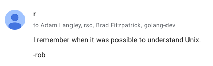

This repository holds a Go module that demonstrates an oddity of the Go tool's
test runner. The way tests with sub-processes is handled differs depending on
whether or not you specify the package name on the command line.

The [`run.sh`](run.sh) script demonstrates this:

```
$ ./run.sh
This one waits for the sub-process to exit before exiting.
+ go test -v -count=1 .
=== RUN   TestHang
--- PASS: TestHang (0.00s)
PASS
HANG
ok  	github.com/adg/hang	5.511s
This one returns instantly, but the sub-process is still running.
+ go test -v -count=1
=== RUN   TestHang
--- PASS: TestHang (0.00s)
PASS
ok  	github.com/adg/hang	0.095s
```

Note that the only difference between the `go test` invocations is the presence
of the package name (`.` in this case).

See the [test source code](hang_test.go) for the details.


